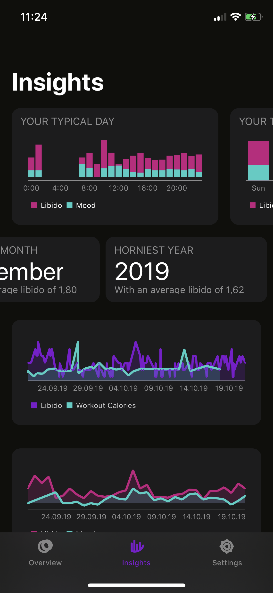
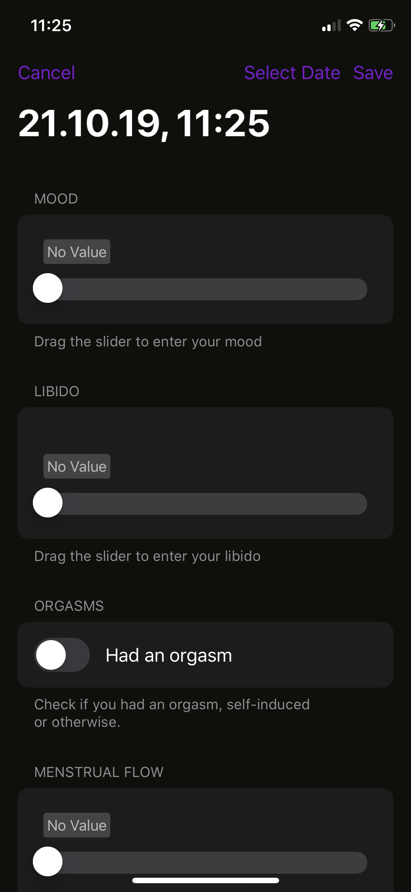

Lots of people track their workouts, their diet, or their sleep. <b>Libi.app</b> allows them to track their mood, libido and sexual activity! Free in the App Store, in-app-purchase to remove ads.

## What is Libi?
Libi is an app that allows you to enter your current libido level and mood. It will then allow you to track those over the course of the month. You can also enter sexual activiy, orgasms, and menstruation. 

In addition, the app can -- with your permission -- pull various data from the Apple Health app on your iPhone. 

With all this data, Libi allows you to find correlations and trends allowing you to be more aware of your mental health 

## It tracks ... what??
Libi is an app I wrote to find more about my libido and mood. When do they ebb and flow? What are they influenced by? Is it true that I'm always in way better mood during summer, or is that just a wrong perception?

I decided to get scientific about it. The app uses a technique called [Experience Sampling](https://en.wikipedia.org/wiki/Experience_sampling_method): it randomly collects data at different times each day and uses that to calculate your average day, week, etc. Using this data, it can help you find correlations to data that the Health app can provide.

## Key Features

- **Track your Libido, Mood, and Sexual Activity**
- **Track your Menstrual Cycle**
- **Find Connections and Correlations**
- **Enter Data quickly and easily**
- **Stay Private and Secure**
- **Sync with Health App**
- **Customize Data Entry and Display**
- **Use the app for free with ads, or pay a small fee to remove them**

Read more about [Libi's features and their benefits](/benefits) in detail!

## Data Security and Privacy
Libido and Mood data is incredibly sensitive. This is why all data you enter into the app is only stored on your devices. Libido, Mood, and Orgasm data is stored directly into Core Data. Sexual Activity and Menstrual Flow are stored into the Health app using Apple HealthKit. 

None of that data is uploaded to any servers. If the app ever gains the ability to do so, it will be a completely optional feature that you'll have to explicitly opt-in to enable. 

In ad-supported mode, the app includes the Admob SDK, which will assign users of the app a unique ID and report that back to Google's servers. Ads cannot access any user data entered into the app though. In paid mode, I'm trying hard to not even load the Admob SDK into memory.

## Premium In-App Purchase and Pricing
Libi is completely free, with ads. If you'd rather have an ad-free experience (I mean who doesn't?), you can pay a small fee of **$2.49** (or 2.49 €) per year to remove the ads. 

## App Store Link
An app store link will appear here once the app is released. If you would like a TestFlight invite or a Promo Code, feel free to email me at [libi@breakthesystem.org](mailto:libi@breakthesystem.org).

## Who wrote Libi?
Hi, I'm Daniel Jilg! I'm an app developer from Augsburg, Germany. 35 years of age, married, two cats. My previous occupations included being a CTO for a medium size app development agency, and founder of a sadly failed startup that wanted to shoot new kinds of communications satellites into orbit. These days I mostly freelance for companies who build privacy-enhancing apps, or browsers, or both. And I build the occasional app myself — Libi is the first of a new wave of those, but my first app, TenPlusTwo, was among the first 100 apps on the iOS App Store when it launched way back when.

I'm super into space. If you are too, check out my talks about [computers in space](https://www.youtube.com/watch?v=OTys3VzCe7o) and [calculating orbits in the solar system using swift](https://www.youtube.com/watch?v=09iTidqkriw) 🚀

Other things I'm into are feminism, wakeboarding, live translating conference talks, and racing cars real fast around race tracks.

You can contact me at [libi@breakthesystem.org](mailto:libi@breakthesystem.org) or [say hi on twitter](https://twitter.com/breakthesystem) or even go to [LinkedIn if you are into that](https://www.linkedin.com/in/danieljilg/).

## Let's see some Design, Screenshots and Icons

Control-Click these and select *Save Image to Downloads* to download them, or drag them out of the browser onto your desktop.

### Logo and Icons

The app icon comes in two flavors. The light flavor is being used for the iOS home screen, the dark one for accents.

----

### Screenshots in Light Mode

### Screenshots in Dark Mode

### Pictures of Daniel

